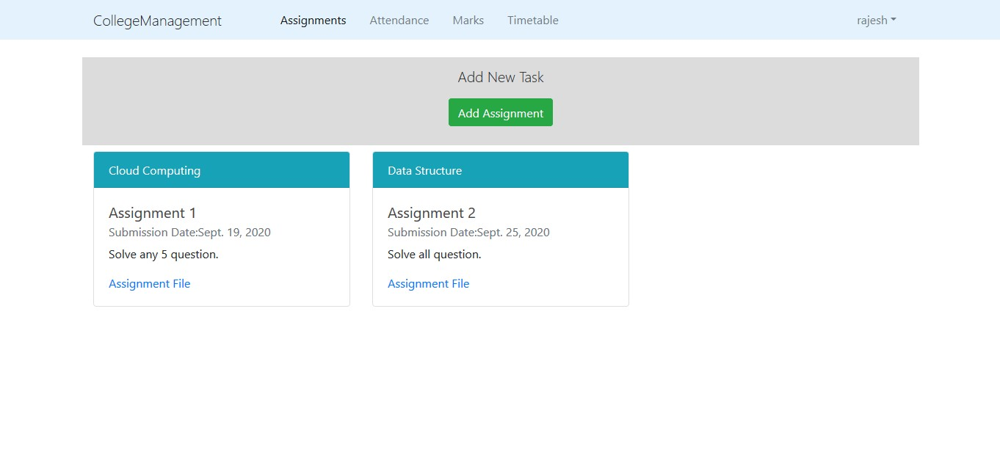

# College-Management
College Management is a one-stop website for students and teachers. It allows interaction between students and teachers. On this website teachers can post assignments, enter marks and attendance and students can download assignment files,submit their solutions,check marks and attendance in respective subjects.
To run website: http://collegemanagement.pythonanywhere.com/
## Prerequisites

Before you begin, ensure you have met the following requirements:
- Python
- Django
- Django-Crispy-Forms

## Using College-Management

Run the manage.py file in College_Management directory using following command:
```
python manage.py runserver
```
Go to http://127.0.0.1:8000/ to run the website.

- ### LOGIN

  - To login as a student or as a teacher use the following username and password:
    
    For student: username: divya, password: clgmgmtdivya
    
    For teachers: username: rajesh, password:clgmgmtrajesh
    
    To see the database tables, go to http://127.0.0.1:8000/admin use the following credentials to login:
    
    username:admin, password: clgmgmtadmin
    
## UI 

Student User Interface:


Teacher user Interface:




